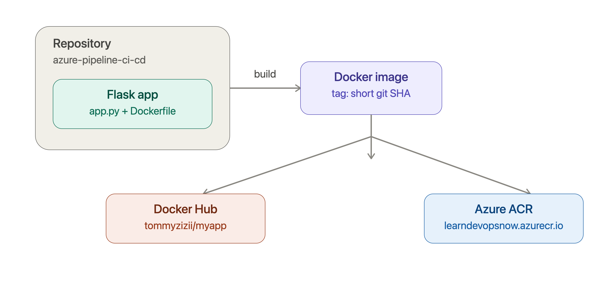
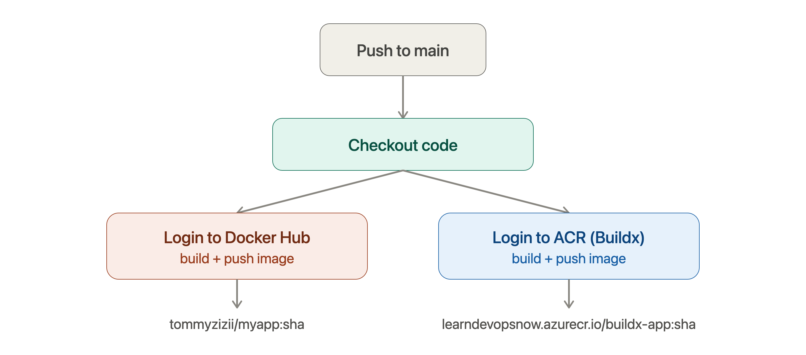

# azure-pipeline-ci-cd

A small Flask app used to practice building Docker images with GitHub Actions and pushing them to **two container registries**: Docker Hub and Azure Container Registry (ACR), using Docker Buildx.

## What this project does

- A minimal Flask app (`app.py`) is containerized with a `Dockerfile`.
- On every push to `main`, GitHub Actions automatically:
  - Builds the Docker image
  - Tags it with the short Git commit SHA
  - Pushes it to **Docker Hub**
  - Pushes it to **Azure Container Registry** (via `docker buildx`)

This gives hands-on practice with CI/CD pipelines, multi-registry publishing, and container build tooling across two ecosystems (Docker Hub + Azure).

## Architecture



## CI/CD workflow



## Workflows

| File | Registry | Trigger | Notes |
|---|---|---|---|
| `.github/workflows/docker.yml` | Docker Hub | push to `main` | uses `docker/login-action` + `docker build`/`docker push` |
| `.github/workflows/buildx.yml` | Azure Container Registry | push to `main` | uses `docker/setup-buildx-action` + `docker buildx build --push` |

Both workflows tag the image with the first 7 characters of the commit SHA (`${GITHUB_SHA::7}`).

## Running locally

```bash
# build
docker build -t myapp .

# run
docker run -d -p 5000:5000 --name myapp myapp

# check
curl http://localhost:5000
curl http://localhost:5000/health
```

## Pulling the published image

```bash
# from Docker Hub
docker pull tommyzizii/myapp:<short-sha>

# from Azure Container Registry
az acr login --name learndevopsnow
docker pull learndevopsnow.azurecr.io/buildx-app:<short-sha>
```

## Environment variables

| Variable | Default | Description |
|---|---|---|
| `APP_NAME` | `Hello Docker World` | Displayed on the home page |
| `APP_VERSION` | `1.0.0` | Displayed on the home page |
| `ENVIRONMENT` | `development` | Displayed on the home page |

## Roadmap / possible next steps

- [ ] Switch registry auth to OIDC (federated credentials) instead of stored secrets
- [ ] Add vulnerability scanning (Trivy) before push
- [ ] Deploy the pushed image to Azure Container Apps